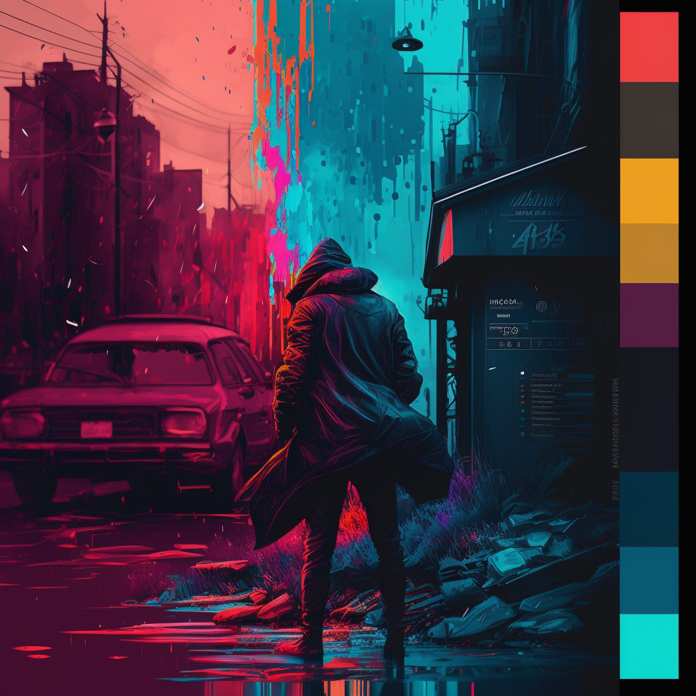

# f333-colors

I don't like the theme online so I wrote mine with some strange color choises.

I can't find a good theme for the debug mode so I make them looking like what i prefer for the occasion.
